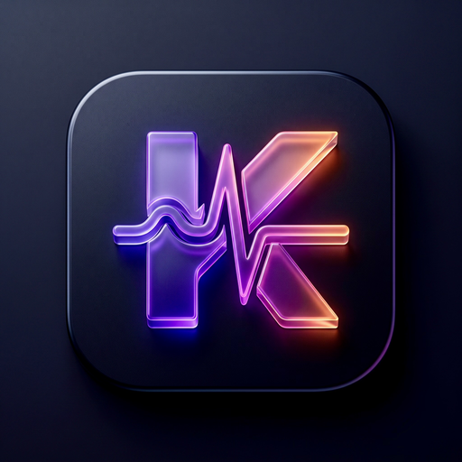

<h1 align="center">🏥 KHealth 🏥</h1>

<p align="center">
    <a href="https://mailchi.mp/kotlinweekly/kotlin-weekly-434#:~:text=Libraries-,KHealth,-KHealth%20is%20a">
        
    </a>
    
    
    
</p>

<p align="center">
    
</p>

**KHealth** (_Kotlin Health_) is a modern Kotlin Multiplatform library providing a unified, type-safe API over Android's [Health Connect](https://developer.android.com/health-and-fitness/guides/health-connect) and Apple's [HealthKit](https://developer.apple.com/documentation/healthkit) (iOS and watchOS). It is designed from the ground up for seamless use in Kotlin Multiplatform (KMP) and Compose Multiplatform projects.

---

## ✨ Features

- 🚀 **Zero-Boilerplate Instantiation**: Call `val kHealth = KHealth()` directly in `commonMain` across Android, iOS, and watchOS.
- 🤖 **Android Auto-Initialization**: Automatically initializes Health Connect via `ContentProvider`. No manual `initialise()` call or Android `Context` required in shared code.
- 🎯 **Type-Safe Generic Reads**: `readRecords(KHReadRequest.HeartRate(...))` directly returns `List<KHRecord.HeartRate>` without type casting or runtime checks.
- 🛡️ **Ergonomic Permissions API**: Check, request, and verify permissions with expressive extensions like `perms.isGranted(...)`, `perms.allGranted()`, and `kHealth.hasPermission(...)`.
- ⚡ **Flexible API**: Vararg and collection overloads for reading, writing, and permission management.
- 📱 **Multiplatform Sample Apps**: Clean architectural separation with shared business logic and native UIs (Jetpack Compose on Android, SwiftUI on iOS & watchOS).

---

## 📱 Sample Apps

> [!NOTE]  
> Sample apps showcasing integration can be found in the `sampleApps` directory:
> - `sampleApps/shared`: Shared KMP logic, repository layer, and sample health interactions.
> - `sampleApps/android`: Android Jetpack Compose app with Health Connect permission rationale.
> - `sampleApps/apple`: SwiftUI iOS and watchOS applications.

---

## 🚀 Getting Started


Add the dependency to your shared module's `build.gradle.kts`:

```kotlin
kotlin {
    sourceSets {
        commonMain.dependencies {
            implementation("io.github.shubhamsinghshubham777:khealth:2.0.1")
        }
    }
}
```

Or using Gradle version catalogs:

```toml
[versions]
khealth = "2.0.1"

[libraries]
khealth = { module = "io.github.shubhamsinghshubham777:khealth", version.ref = "khealth" }
```

```kotlin
kotlin {
    sourceSets {
        commonMain.dependencies {
            implementation(libs.khealth)
        }
    }
}
```

---

## ⚙️ Platform Setup

### 1. Apple (iOS & watchOS)

Add HealthKit usage descriptions to your `Info.plist`:

```xml
<plist version="1.0">
<dict>
    <!-- ... -->
    <key>NSHealthUpdateUsageDescription</key>
    <string>We need permission to save health records to Apple Health.</string>
    <key>NSHealthShareUsageDescription</key>
    <string>We need permission to read your health records from Apple Health.</string>
</dict>
</plist>
```

In Xcode, ensure the **HealthKit** capability is enabled in your application target's **Signing & Capabilities** tab (with *Clinical Health Records* if applicable).

---

### 2. Android (Health Connect)

#### A. Query Declaration & Permissions Rationale

Add the following to your `AndroidManifest.xml`:

```xml
<!-- Check if Health Connect is installed -->
<queries>
    <package android:name="com.google.android.apps.healthdata" />
</queries>

<application ...>
    <!-- Android 13 and below: Rationale activity for Health Connect -->
    <activity
        android:name=".PermissionsRationaleActivity"
        android:exported="true">
        <intent-filter>
            <action android:name="androidx.health.ACTION_SHOW_PERMISSIONS_RATIONALE" />
        </intent-filter>
    </activity>

    <!-- Android 14+: Rationale activity alias for Health Connect -->
    <activity-alias
        android:name="ViewPermissionUsageActivity"
        android:exported="true"
        android:permission="android.permission.START_VIEW_PERMISSION_USAGE"
        android:targetActivity=".PermissionsRationaleActivity">
        <intent-filter>
            <action android:name="android.intent.action.VIEW_PERMISSION_USAGE" />
            <category android:name="android.intent.category.HEALTH_PERMISSIONS" />
        </intent-filter>
    </activity-alias>
</application>
```

> [!TIP]
> KHealth automatically initializes its Android context via a built-in `ContentProvider`. No manual context passing or `initialise()` calls are needed!

#### B. Declare Required Health Connect Permissions

Add the permissions matching the data types your app accesses:

| Type | Manifest Permissions |
| :--- | :--- |
| ACTIVE_CALORIES_BURNED | `android.permission.health.READ_ACTIVE_CALORIES_BURNED`<br/>`android.permission.health.WRITE_ACTIVE_CALORIES_BURNED` |
| BASAL_METABOLIC_RATE | `android.permission.health.READ_BASAL_METABOLIC_RATE`<br/>`android.permission.health.WRITE_BASAL_METABOLIC_RATE` |
| BLOOD_GLUCOSE | `android.permission.health.READ_BLOOD_GLUCOSE`<br/>`android.permission.health.WRITE_BLOOD_GLUCOSE` |
| BLOOD_PRESSURE | `android.permission.health.READ_BLOOD_PRESSURE`<br/>`android.permission.health.WRITE_BLOOD_PRESSURE` |
| BODY_FAT | `android.permission.health.READ_BODY_FAT`<br/>`android.permission.health.WRITE_BODY_FAT` |
| BODY_TEMPERATURE | `android.permission.health.READ_BODY_TEMPERATURE`<br/>`android.permission.health.WRITE_BODY_TEMPERATURE` |
| BODY_WATER_MASS | `android.permission.health.READ_BODY_WATER_MASS`<br/>`android.permission.health.WRITE_BODY_WATER_MASS` |
| BONE_MASS | `android.permission.health.READ_BONE_MASS`<br/>`android.permission.health.WRITE_BONE_MASS` |
| CERVICAL_MUCUS | `android.permission.health.READ_CERVICAL_MUCUS`<br/>`android.permission.health.WRITE_CERVICAL_MUCUS` |
| DISTANCE | `android.permission.health.READ_DISTANCE`<br/>`android.permission.health.WRITE_DISTANCE` |
| ELEVATION_GAINED | `android.permission.health.READ_ELEVATION_GAINED`<br/>`android.permission.health.WRITE_ELEVATION_GAINED` |
| EXERCISE | `android.permission.health.READ_EXERCISE`<br/>`android.permission.health.WRITE_EXERCISE` |
| FLOORS_CLIMBED | `android.permission.health.READ_FLOORS_CLIMBED`<br/>`android.permission.health.WRITE_FLOORS_CLIMBED` |
| HEART_RATE | `android.permission.health.READ_HEART_RATE`<br/>`android.permission.health.WRITE_HEART_RATE` |
| HEART_RATE_VARIABILITY | `android.permission.health.READ_HEART_RATE_VARIABILITY`<br/>`android.permission.health.WRITE_HEART_RATE_VARIABILITY` |
| HEIGHT | `android.permission.health.READ_HEIGHT`<br/>`android.permission.health.WRITE_HEIGHT` |
| HYDRATION | `android.permission.health.READ_HYDRATION`<br/>`android.permission.health.WRITE_HYDRATION` |
| INTERMENSTRUAL_BLEEDING | `android.permission.health.READ_INTERMENSTRUAL_BLEEDING`<br/>`android.permission.health.WRITE_INTERMENSTRUAL_BLEEDING` |
| LEAN_BODY_MASS | `android.permission.health.READ_LEAN_BODY_MASS`<br/>`android.permission.health.WRITE_LEAN_BODY_MASS` |
| MENSTRUATION | `android.permission.health.READ_MENSTRUATION`<br/>`android.permission.health.WRITE_MENSTRUATION` |
| NUTRITION | `android.permission.health.READ_NUTRITION`<br/>`android.permission.health.WRITE_NUTRITION` |
| OVULATION_TEST | `android.permission.health.READ_OVULATION_TEST`<br/>`android.permission.health.WRITE_OVULATION_TEST` |
| OXYGEN_SATURATION | `android.permission.health.READ_OXYGEN_SATURATION`<br/>`android.permission.health.WRITE_OXYGEN_SATURATION` |
| POWER | `android.permission.health.READ_POWER`<br/>`android.permission.health.WRITE_POWER` |
| RESPIRATORY_RATE | `android.permission.health.READ_RESPIRATORY_RATE`<br/>`android.permission.health.WRITE_RESPIRATORY_RATE` |
| RESTING_HEART_RATE | `android.permission.health.READ_RESTING_HEART_RATE`<br/>`android.permission.health.WRITE_RESTING_HEART_RATE` |
| SEXUAL_ACTIVITY | `android.permission.health.READ_SEXUAL_ACTIVITY`<br/>`android.permission.health.WRITE_SEXUAL_ACTIVITY` |
| SLEEP | `android.permission.health.READ_SLEEP`<br/>`android.permission.health.WRITE_SLEEP` |
| SPEED | `android.permission.health.READ_SPEED`<br/>`android.permission.health.WRITE_SPEED` |
| STEPS | `android.permission.health.READ_STEPS`<br/>`android.permission.health.WRITE_STEPS` |
| VO2_MAX | `android.permission.health.READ_VO2_MAX`<br/>`android.permission.health.WRITE_VO2_MAX` |
| WEIGHT | `android.permission.health.READ_WEIGHT`<br/>`android.permission.health.WRITE_WEIGHT` |
| WHEELCHAIR_PUSHES | `android.permission.health.READ_WHEELCHAIR_PUSHES`<br/>`android.permission.health.WRITE_WHEELCHAIR_PUSHES` |

---

## 📖 Usage Guide

### 1. Instantiate

Instantiate `KHealth` directly in your shared multiplatform code (e.g., in a ViewModel, Repository, or Dependency Injection module):

```kotlin
// In commonMain (KMP / Compose Multiplatform)
val kHealth = KHealth()
```

> [!NOTE]
> On Android, if your application needs to prompt the user with permission dialogs via `requestPermissions()`, bind your active `ComponentActivity`:
> ```kotlin
> // Option A: Bind activity to an existing instance
> kHealth.bindActivity(activity)
> 
> // Option B: Construct with activity in Android source set
> val kHealth = KHealth(activity)
> ```

---

### 2. Check Permissions

Check current permission states without prompting the user:

```kotlin
val permissions: Set<KHPermission> = kHealth.checkPermissions(
    KHPermission.ActiveCaloriesBurned(read = true, write = true),
    KHPermission.HeartRate(read = true, write = false),
)
```

You can also pass an `Iterable<KHPermission>`:

```kotlin
val permissionList = listOf(
    KHPermission.StepCount(read = true, write = false),
    KHPermission.Weight(read = true, write = true),
)
val permissions = kHealth.checkPermissions(permissionList)
```

---

### 3. Request Permissions

Request access from the user:

```kotlin
val permissions: Set<KHPermission> = kHealth.requestPermissions(
    KHPermission.ActiveCaloriesBurned(read = true, write = true),
    KHPermission.HeartRate(read = true, write = false),
)
```

---

### 4. Verify Permission Status

KHealth provides intuitive extension functions to verify granted permissions:

```kotlin
// Check if a specific permission is granted with the requested read/write access
val canWriteCalories: Boolean = permissions.isGranted(
    KHPermission.ActiveCaloriesBurned(read = false, write = true)
)

// Check if all requested permissions in the response are granted
val allGranted: Boolean = permissions.allGranted()

// Query KHealth directly at any time
val canReadHeartRate: Boolean = kHealth.hasPermission(
    KHPermission.HeartRate(read = true, write = false)
)
```

---

### 5. Write Records

Write one or more health records using type-safe constructors:

```kotlin
import kotlinx.datetime.Clock
import kotlin.time.Duration.Companion.minutes

val response: KHWriteResponse = kHealth.writeRecords(
    KHRecord.ActiveCaloriesBurned(
        unit = KHUnit.Energy.KiloCalorie,
        value = 145.0,
        startTime = Clock.System.now().minus(30.minutes),
        endTime = Clock.System.now(),
    ),
    KHRecord.HeartRate(
        samples = listOf(
            KHHeartRateSample(
                beatsPerMinute = 126,
                time = Clock.System.now().minus(10.minutes),
            ),
            KHHeartRateSample(
                beatsPerMinute = 132,
                time = Clock.System.now().minus(5.minutes),
            ),
        ),
    ),
    KHRecord.BasalMetabolicRate(
        unit = KHUnit.Energy.KiloCalorie,
        value = 1600.0,
        time = Clock.System.now(),
    ),
)

when (response) {
    is KHWriteResponse.Success -> println("All records written successfully ✅")
    is KHWriteResponse.SomeFailed -> println("Some records failed to write ⚠️")
    is KHWriteResponse.Failed -> println("Write failed: ${response.throwable} ❌")
}
```

---

### 6. Read Records (Type-Safe Generics)

Reading records is fully generic and type-safe. The returned list matches the exact record type requested—no manual casting needed!

```kotlin
import kotlinx.datetime.Clock
import kotlin.time.Duration.Companion.days

// Returns List<KHRecord.HeartRate>
val heartRateRecords = kHealth.readRecords(
    KHReadRequest.HeartRate(
        startTime = Clock.System.now().minus(7.days),
        endTime = Clock.System.now(),
    )
)

heartRateRecords.forEach { record ->
    record.samples.forEach { sample ->
        println("BPM: ${sample.beatsPerMinute} at ${sample.time}")
    }
}

// Returns List<KHRecord.StepCount>
val stepRecords = kHealth.readRecords(
    KHReadRequest.StepCount(
        startTime = Clock.System.now().minus(1.days),
        endTime = Clock.System.now(),
    )
)

val totalSteps = stepRecords.sumOf { it.count }
println("Total steps today: $totalSteps")
```

---

## 📊 Supported Data Types

| Type | Android | Apple (iOS & watchOS) | Notes / Units |
| :--- | :---: | :---: | :--- |
| ActiveCaloriesBurned | ✅ | ✅ | Energy (`Calorie`, `KiloCalorie`, `Joule`, `KiloJoule`) |
| BasalMetabolicRate | ✅ | ✅ | Energy per day (`Calorie`, `KiloCalorie`, `Joule`, `KiloJoule`) |
| BloodGlucose | ✅ | ✅ | `MilliMolesPerLiter`, `MilliGramsPerDeciLiter` |
| BloodPressure | ✅ | ✅ | `MillimetersOfMercury` (Systolic & Diastolic) |
| BodyFat | ✅ | ✅ | `Percentage` |
| BodyTemperature | ✅ | ✅ | `Celsius`, `Fahrenheit` |
| BodyWaterMass | ✅ | | `Kilogram`, `Gram`, `Milligram`, `Pound`, `Ounce` |
| BoneMass | ✅ | | `Kilogram`, `Gram`, `Milligram`, `Pound`, `Ounce` |
| CervicalMucus | ✅ | ✅ | Sensation & appearance states |
| CyclingPedalingCadence | ✅ | | Revolutions per minute |
| Distance | ✅ | ✅ | `Meter`, `Kilometer`, `Mile`, `Foot`, `Inch` |
| ElevationGained | ✅ | | `Meter`, `Kilometer`, `Mile`, `Foot`, `Inch` |
| Exercise | ✅ | ✅ | Supports 70+ exercise/workout categories |
| FloorsClimbed | ✅ | ✅ | Floor count |
| HeartRate | ✅ | ✅ | Samples with BPM and timestamps |
| HeartRateVariability | ✅ | ✅ | RMSSD in milliseconds |
| Height | ✅ | ✅ | `Meter`, `Kilometer`, `Mile`, `Foot`, `Inch` |
| Hydration | ✅ | ✅ | `Liter`, `MilliLiter`, `FluidOunceUs` |
| IntermenstrualBleeding | ✅ | ✅ | Spotting records |
| LeanBodyMass | ✅ | ✅ | `Kilogram`, `Gram`, `Milligram`, `Pound`, `Ounce` |
| MenstruationPeriod | ✅ | | Menstruation period sessions |
| MenstruationFlow | ✅ | ✅ | Light, Medium, Heavy, Unspecified |
| Nutrition | ✅ | ✅ | Macros (Protein, Carbs, Fat) & Micronutrients |
| OvulationTest | ✅ | ✅ | Inconclusive, Negative, Positive, High, etc. |
| OxygenSaturation | ✅ | ✅ | Blood oxygen percentage |
| Power | ✅ | ✅ | `Watt`, `KiloWatt` |
| RespiratoryRate | ✅ | ✅ | Breaths per minute |
| RestingHeartRate | ✅ | ✅ | Beats per minute |
| SexualActivity | ✅ | ✅ | Protection used / unspecified |
| SleepSession | ✅ | ✅ | Sleep stages (Awake, Light, Deep, REM, etc.) |
| Speed | ✅ | | `MetersPerSecond`, `KilometersPerHour`, `MilesPerHour` |
| RunningSpeed | | ✅ | `MetersPerSecond`, `KilometersPerHour`, `MilesPerHour` |
| CyclingSpeed | | ✅ | `MetersPerSecond`, `KilometersPerHour`, `MilesPerHour` |
| StepCount | ✅ | ✅ | Step counts over time ranges |
| Vo2Max | ✅ | ✅ | `MillilitersPerMinutePerKilogram` |
| Weight | ✅ | ✅ | `Kilogram`, `Gram`, `Milligram`, `Pound`, `Ounce` |
| WheelchairPushes | ✅ | ✅ | Wheelchair push counts |

---

## 🏃 Supported Exercise Types

KHealth supports reading and writing extensive exercise and workout types:

| Type | Android | Apple (iOS & watchOS) | Type | Android | Apple (iOS & watchOS) |
| :--- | :---: | :---: | :--- | :---: | :---: |
| AmericanFootball | ✅ | ✅ | MartialArts | ✅ | ✅ |
| Archery | | ✅ | MindAndBody | | ✅ |
| AustralianFootball | ✅ | ✅ | MixedCardio | | ✅ |
| Badminton | ✅ | ✅ | MixedMetabolicCardioTraining | | ✅ |
| Barre | | ✅ | Other | ✅ | ✅ |
| Baseball | ✅ | ✅ | PaddleSports | | ✅ |
| Basketball | ✅ | ✅ | Paddling | ✅ | ✅ |
| Biking | ✅ | ✅ | Paragliding | ✅ | ✅ |
| BikingStationary | ✅ | ✅ | Pickleball | | ✅ |
| BootCamp | ✅ | ✅ | Pilates | ✅ | ✅ |
| Bowling | | ✅ | Play | | ✅ |
| Boxing | ✅ | ✅ | PreparationAndRecovery | | ✅ |
| Calisthenics | ✅ | ✅ | Racquetball | ✅ | ✅ |
| CardioDance | | ✅ | RockClimbing | ✅ | ✅ |
| Climbing | | ✅ | RollerHockey | ✅ | ✅ |
| Cooldown | | ✅ | Rowing | ✅ | ✅ |
| CoreTraining | | ✅ | RowingMachine | ✅ | ✅ |
| Cricket | ✅ | ✅ | Rugby | ✅ | ✅ |
| CrossCountrySkiing | | ✅ | Running | ✅ | ✅ |
| CrossTraining | | ✅ | RunningTreadmill | ✅ | ✅ |
| Curling | | ✅ | Sailing | ✅ | ✅ |
| Cycling | | ✅ | ScubaDiving | ✅ | ✅ |
| Dance | | ✅ | Skating | ✅ | ✅ |
| DanceInspiredTraining | | ✅ | SkatingSports | | ✅ |
| Dancing | ✅ | ✅ | Skiing | ✅ | ✅ |
| DiscSports | | ✅ | SnowSports | | ✅ |
| DownhillSkiing | | ✅ | Snowboarding | ✅ | ✅ |
| Elliptical | ✅ | ✅ | Snowshoeing | ✅ | ✅ |
| EquestrianSports | | ✅ | Soccer | ✅ | ✅ |
| ExerciseClass | ✅ | ✅ | SocialDance | | ✅ |
| Fencing | ✅ | ✅ | Softball | ✅ | ✅ |
| Fishing | | ✅ | Squash | ✅ | ✅ |
| FitnessGaming | | ✅ | StairClimbing | ✅ | ✅ |
| Flexibility | | ✅ | StairClimbingMachine | ✅ | ✅ |
| FrisbeeDisc | | ✅ | Stairs | | ✅ |
| FunctionalStrengthTraining | | ✅ | StepTraining | | ✅ |
| Golf | ✅ | ✅ | StrengthTraining | ✅ | ✅ |
| GuidedBreathing | ✅ | ✅ | Stretching | ✅ | ✅ |
| Gymnastics | ✅ | ✅ | Surfing | ✅ | ✅ |
| HandCycling | | ✅ | SurfingSports | | ✅ |
| Handball | ✅ | ✅ | SwimBikeRun | | ✅ |
| HighIntensityIntervalTraining | ✅ | ✅ | Swimming | | ✅ |
| Hiking | ✅ | ✅ | SwimmingOpenWater | ✅ | |
| Hockey | | ✅ | SwimmingPool | ✅ | |
| Hunting | | ✅ | TableTennis | ✅ | ✅ |
| IceHockey | ✅ | ✅ | TaiChi | | ✅ |
| IceSkating | ✅ | ✅ | Tennis | ✅ | ✅ |
| JumpRope | | ✅ | TrackAndField | | ✅ |
| Kickboxing | | ✅ | TraditionalStrengthTraining | | ✅ |
| Lacrosse | | ✅ | Transition | | ✅ |
| UnderwaterDiving | | ✅ | Volleyball | ✅ | ✅ |
| Walking | ✅ | ✅ | WaterFitness | | ✅ |
| WaterPolo | ✅ | ✅ | WaterSports | | ✅ |
| Weightlifting | ✅ | ✅ | Wheelchair | ✅ | ✅ |
| WheelchairRunPace | | ✅ | WheelchairWalkPace | | ✅ |
| Wrestling | | ✅ | Yoga | ✅ | ✅ |

> [!NOTE]
> Types unsupported by a specific platform are safely ignored.

---

## 🏗️ Project Architecture

```
KHealth/
├── khealth/                  # Core KMP library module
│   ├── commonMain/           # Interfaces (KHealth), data models, permissions, requests
│   ├── androidMain/          # Health Connect integration, auto-init provider, mappers
│   └── appleMain/            # HealthKit integration (iOS & watchOS), mappers, readers, writers
└── sampleApps/               # Sample demonstration apps
    ├── shared/               # Shared KMP module with health repository & operations
    ├── android/              # Native Android app (Jetpack Compose)
    └── apple/                # Native Apple apps (SwiftUI iOS & watchOS)
```

---

## 🤝 Contributing

Contributions are welcome! Please feel free to open an issue or submit a Pull Request.

---

## 📄 License

This library is licensed under the Apache 2.0 License. See the [LICENSE](LICENSE) file for details.
